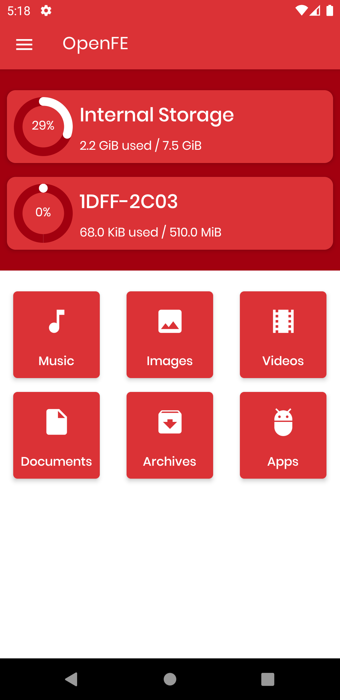

# OpenFE-Android


[](https://github.com/DATL4G/OpenFE-Android)

[](https://github.com/DATL4G/OpenFE-Android)

[](https://github.com/DATL4G/OpenFE-Android)

OpenFE-Android is an open source file explorer for Android
* browse files and folders
* application icons are associated with folders
* info about installed Apps and possibility to backup each

## Actions Overview
Light Theme		|Dark Theme		
:---------------------:|:---------------------:
|  

## Installation
Clone this repository and import into **Android Studio**
##### HTTPS
```bash
git clone https://github.com/DATL4G/OpenFE-Android.git
```
##### SSH
```bash
git clone git@github.com:DATL4G/OpenFE-Android.git
```
##### GitHub CLI
```bash
gh repo clone DATL4G/OpenFE-Android
```

## Maintainers
This project is mantained by:
| Avatar | Contributor |
|---|:---:|
| [](http://github.com/DatL4g) | [DatLag](http://github.com/DatL4g) |

## Contributing

1. Fork it
2. Create your feature branch (git checkout -b my-new-feature)
3. Commit your changes (git commit -m 'Add some feature')
5. Push your branch (git push origin my-new-feature)
6. Create a new Pull Request and check if testing is successful

## License

View full license [here](LICENSE). In short:

> Permissions of this strong copyleft license are conditioned on making available complete source code of licensed works and modifications, which include larger works using a licensed work, under the same license.
>Copyright and license notices must be preserved. Contributors provide an express grant of patent rights.
